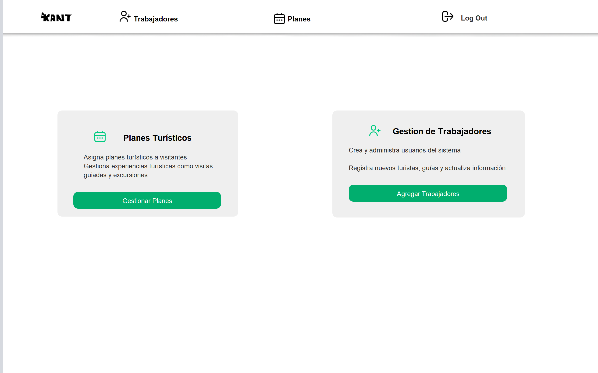
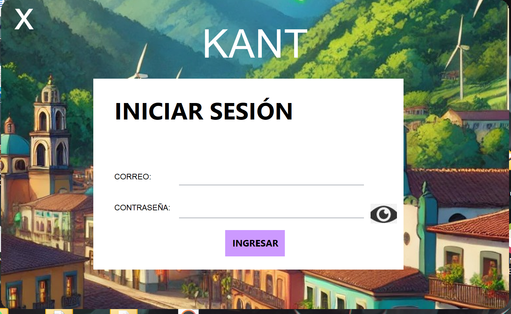
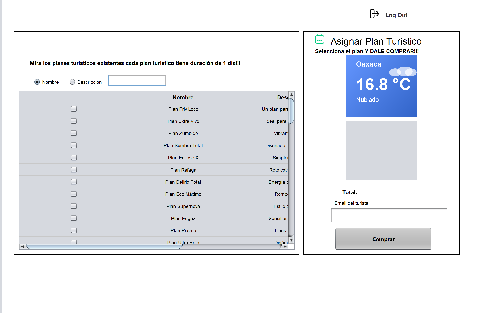

#  AppKant 

**AppKant** es una aplicación de escritorio desarrollada en **Java** con interfaz gráfica basada en `Swing`, diseñada para gestionar y vender **planes turísticos**. El sistema está dividido en dos módulos principales: **Administrador** y **Recepcionista**, cada uno con sus propias funciones y responsabilidades dentro de la aplicación. Este proyecto está diseñado para gestionar planes turísticos y autenticaciones, integrando una interfaz gráfica Java Swing y una base de datos SQL. Es útil como sistema de ventas .
---


##  Estructura del Proyecto


###  Módulo Recepcionista (`Recepcionista.java`)
- Visualiza y filtra los planes turísticos disponibles.
- Selecciona uno o varios planes para cotizar.
- Muestra el total acumulado en tiempo real.
- Visualiza la imagen correspondiente del plan seleccionado.
- Permite buscar por nombre o descripción mediante filtros dinámicos.

###  Módulo Administrador (`Administrador.java`)
- Gestiona el catálogo completo de planes turísticos.
- Agrega, edita o elimina planes desde la base de datos.
- Carga imágenes desde rutas internas o externas.
- Permite a los administradores monitorear qué planes están disponibles y sus detalles.

---

##  Creación Dinámica de Tablas

Ambos módulos usan métodos para construir las tablas de forma programática a partir de los datos de la base de datos. Estos métodos permiten que la interfaz sea completamente dinámica.

### Método: `construirTablaPlanes(...)`

Este método consulta los datos desde la tabla `Planes` y genera visualmente cada fila con sus columnas, incluyendo un `JCheckBox`, nombre, descripción, precio y la lógica de actualización de totales.

```java
private void construirTablaPlanes(JPanel panelPlanes) {
    // Configuración inicial del panel
    panelPlanes.setOpaque(true);
    panelPlanes.removeAll();
    panelPlanes.setLayout(new BoxLayout(panelPlanes, BoxLayout.Y_AXIS));

    // Estructura de columnas
    String[] columnas = {"", "Nombre", "Descripción", "Precio"};

    // Encabezado
    JPanel header = new JPanel(new GridLayout(1, columnas.length));
    for (String col : columnas) {
        JLabel lbl = new JLabel(col, JLabel.CENTER);
        header.add(lbl);
    }
    panelPlanes.add(header);

    // Carga desde base de datos
    String query = "SELECT planesID, nombre, descripcion, precio, imagen FROM Planes";
    // Se construye cada fila como un JPanel con su propia lógica
}
```

Cada `JCheckBox` tiene su `ActionListener` que añade o elimina el ID del plan del mapa de seleccionados, recalcula el total y actualiza la imagen mostrada.

---

##  Filtrado Dinámico de la Tabla

### Método: `filtrarPlanes(...)`

Permite aplicar un filtro a los planes en tiempo real con base en el texto ingresado por el usuario. El criterio de búsqueda se determina usando `JRadioButton` para elegir entre nombre o descripción.

```java
String query = buscarPorDescripcion
    ? "SELECT * FROM Planes WHERE descripcion LIKE ?"
    : "SELECT * FROM Planes WHERE nombre LIKE ?";

PreparedStatement stmt = conn.prepareStatement(query);
stmt.setString(1, "%" + texto + "%");
ResultSet rs = stmt.executeQuery();
```

Al igual que en la tabla sin filtrar, se reconstruyen los componentes Swing dinámicamente para reflejar los resultados en la UI.

---

## Gestión de Imágenes

AppKant trabaja con **dos tipos de rutas de imagen**:

- **Imágenes internas:** Recursos incluidos dentro del proyecto, accesibles desde el classpath (`/imagenes/playa.png`, etc.).
- **Imágenes externas:** Archivos cargados desde el equipo local mediante rutas absolutas (por ejemplo: `C:\Usuarios\TuNombre\Imagenes\destino.jpg`).

```java
private ImageIcon cargarIconoImagen(String ruta) throws Exception {
    java.net.URL url = getClass().getResource("/" + ruta);
    if (url != null) return new ImageIcon(url);

    File f = new File(ruta);
    if (f.exists()) return new ImageIcon(f.getAbsolutePath());
    throw new FileNotFoundException("No se encontró la imagen: " + ruta);
}
```

---

##  Base de Datos

AppKant utiliza **SQLite** como sistema de almacenamiento local.

### Tabla: `Planes`

| Campo         | Tipo     | Descripción                               |
|---------------|----------|-------------------------------------------|
| `planesID`    | TEXT     | ID único del plan                         |
| `nombre`      | TEXT     | Nombre del plan turístico                 |
| `descripcion` | TEXT     | Descripción detallada del plan            |
| `precio`      | DOUBLE   | Precio en formato decimal (ej. 1499.99)   |
| `imagen`      | TEXT     | Ruta absoluta o relativa de la imagen     |

---

##  Cálculo de Total Dinámico

```java
checkBox.addActionListener(e -> {
    if (checkBox.isSelected()) {
        if (!idsSeleccionados.contains(id)) {
            idsSeleccionados.add(id);
            preciosSeleccionados.put(id, precio);
        }
    } else {
        idsSeleccionados.remove(id);
        preciosSeleccionados.remove(id);
    }

    double total = preciosSeleccionados.values()
        .stream()
        .mapToDouble(Double::doubleValue)
        .sum();

    totalLabel.setText(String.format("$%.2f", total));
});
```

El total se actualiza automáticamente con cada selección o deselección.

---

##  Visualización de Imágenes

```java
public void mostrarImagenEnPanel(String imagenURL, JPanel panelDestino) {
    SwingUtilities.invokeLater(() -> {
        panelDestino.removeAll();
        try {
            if (imagenURL == null || imagenURL.trim().isEmpty()) {
                throw new Exception("Ruta de imagen vacía");
            }

            ImageIcon icono = cargarIconoImagen(imagenURL);
            Image img = icono.getImage().getScaledInstance(
                panelDestino.getWidth(),
                panelDestino.getHeight(),
                Image.SCALE_SMOOTH
            );

            panelDestino.setLayout(new BorderLayout());
            panelDestino.add(new JLabel(new ImageIcon(img), JLabel.CENTER));
        } catch (Exception ex) {
            panelDestino.setLayout(new BorderLayout());
            panelDestino.add(new JLabel("Imagen no disponible", JLabel.CENTER));
        } finally {
            panelDestino.revalidate();
            panelDestino.repaint();
        }
    });
}
```

---

##  Métodos de Utilidad

```java
private JPanel wrap(Component comp, int ancho) {
    JPanel contenedor = new JPanel(new BorderLayout());
    contenedor.setPreferredSize(new Dimension(ancho, 30));
    contenedor.add(comp, BorderLayout.CENTER);
    return contenedor;
}
```

---


###  `Conexion.java` — Manejo centralizado de la conexión a base de datos

Esta clase es responsable de establecer una **única conexión compartida** a la base de datos SQLite que usa el sistema. Centraliza la lógica de conexión para evitar repeticiones y posibles fugas de recursos.


- Abre una conexión persistente a una base de datos SQLite local.
- Utiliza un patrón `Singleton` simple para reutilizar la conexión (`Connection`).
- Lanza excepciones cuando ocurre un fallo de conexión.
- Puede modificarse fácilmente para usar otro tipo de base de datos (MySQL, PostgreSQL, etc.) si se desea en un futuro.


```java
public class Conexion {
    private static Connection conn;

    public static Connection getConnection() throws SQLException {
        if (conn == null || conn.isClosed()) {
            conn = DriverManager.getConnection("jdbc:sqlite:ruta_basedatos.db");
        }
        return conn;
    }
}
```

>  Esta clase es fundamental para la arquitectura del proyecto porque elimina la necesidad de escribir código de conexión repetido en cada clase, promoviendo buenas prácticas como **reutilización**, **modularidad** y **desacoplamiento**.

---

### `Conector.java` — Clase base de conexión para otros módulos

`Conector.java` actúa como una **superclase base** para cualquier módulo que necesite acceso directo a la base de datos. Internamente, obtiene la conexión llamando al método de `Conexion.java`, por lo que cualquier clase que herede de `Conector` ya tiene acceso a la base sin configuraciones adicionales.

#### ✅ ¿Qué hace?
- Contiene un atributo `protected Connection con` para ser reutilizado por subclases.
- Llama automáticamente a `Conexion.getConnection()` desde el constructor.
- Muestra un mensaje de error si no logra conectarse (con `JOptionPane` para feedback visual inmediato).
- Fomenta la **herencia estructurada** entre módulos.

#### 🔍 Fragmento de código representativo:
```java
public class Conector {
    protected Connection con;

    public Conector() {
        try {
            con = Conexion.getConnection();
        } catch (Exception e) {
            JOptionPane.showMessageDialog(null, "Error en la conexión");
        }
    }
}
```

> ⚙Al heredar esta clase, los módulos como `Administrador`, `Recepcionista`, etc., pueden centrarse en su funcionalidad específica, sin preocuparse por los detalles técnicos de la conexión a la base de datos.

---

### `Login.java` — Ventana principal de autenticación de usuarios

`Login.java` es la **pantalla inicial del sistema AppKant**. Su interfaz gráfica creada con Swing solicita el ingreso de credenciales al usuario y redirige al módulo correspondiente según el rol (Administrador o Recepcionista).

####  ¿Qué hace?
- Presenta un formulario de inicio de sesión con campos de texto y contraseña.
- Verifica credenciales de forma local (puede extenderse a verificación con base de datos).
- Redirige al usuario al módulo adecuado según su rol.
- Muestra mensajes de error si el inicio de sesión falla.
- Puede servir como punto de entrada principal al ejecutar la aplicación.

#### Lógica de flujo:
1. El usuario escribe su nombre de usuario y contraseña.
2. Se compara contra credenciales embebidas:
   - `"admin"` y `"1234"` → abre el módulo `Administrador.java`
   - `"recep"` y `"1234"` → abre el módulo `Recepcionista.java`
3. Si las credenciales no coinciden, muestra un mensaje de error.

####  Fragmento de código representativo:
```java
btnLogin.addActionListener(e -> {
    String usuario = txtUsuario.getText();
    String pass = new String(txtPassword.getPassword());

    if (usuario.equals("admin") && pass.equals("1234")) {
        new Administrador().setVisible(true);
    } else if (usuario.equals("recep") && pass.equals("1234")) {
        new Recepcionista().setVisible(true);
    } else {
        JOptionPane.showMessageDialog(null, "Credenciales incorrectas");
    }
});
```

>  Aunque simple, este sistema de login es funcional y puede evolucionar fácilmente para trabajar con una **tabla `Usuarios` en la base de datos**, añadiendo niveles de seguridad, encriptación o sesiones.

---

###  Relación entre estas tres clases

| Clase         | Rol principal                                 | Relación con otras              |
|---------------|-----------------------------------------------|---------------------------------|
| `Conexion`    | Establece y gestiona la conexión JDBC         | Usada por `Conector`           |
| `Conector`    | Clase base reutilizable con conexión activa   | Extendida por módulos como `Administrador` y `Recepcionista` |
| `Login`       | Controla el acceso a módulos según el rol     | Llama a `Administrador` o `Recepcionista` al autenticarse |

---

 Estas clases no se ven directamente por el usuario final, pero son esenciales para que la aplicación funcione de forma robusta, ordenada y extensible.

------
##  Tecnologías Usadas

- Java 8 o superior
- Swing (`JFrame`, `JPanel`, `JButton`, `JLabel`, etc.)
- SQLite + JDBC
- IDE: NetBeans o IntelliJ IDEA
- Arquitectura simple por capas

---

##  Cómo Ejecutar AppKant

1. Clona este repositorio:

```bash
git clone https://github.com/usuario/AppKant.git
```

2. Abre el proyecto en NetBeans (u otro IDE).
3. Asegúrate de tener Java 8+ instalado.
4. Ajusta la ruta a la base de datos en la clase `Conexion.java` si es necesario.
5. Ejecuta `Recepcionista.java` o `Comprau.java` según el módulo que desees usar.

---

##  Capturas del Sistema

### Vista del Recepcionista


### Selección con Imagen y Total


### Módulo Administrador


---


##  Créditos

- **Equipo:** Equipo 18
- **Proyecto escolar:** AppKant — Venta de Planes Turísticos
- **Institución:** [Nombre de tu escuela]
- **Docente:** [Nombre del docente]

---

## 🎥 Video de Demostración

👉 [Ver en YouTube](https://youtu.be/TU_VIDEO)


